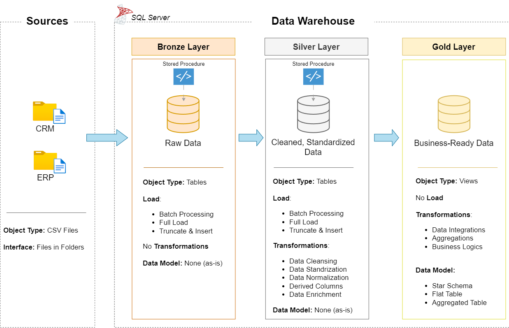

<h1>Data Warehouse and Analytics Project</h1>

## 📘 Welcome

**Data Warehouse and Analytics Project** — a comprehensive portfolio project showcasing a modern data warehousing and analytics solution. This repository demonstrates how to ingest, transform, model, and analyze data using a layered Medallion Architecture, producing business-ready datasets and SQL-driven insights. Designed for data engineers, analysts, and architects, the project highlights industry best practices and end-to-end workflows for reliable, reproducible analytics.

---

## 🏗️ Data Architecture (Medallion Layers)

- **Bronze Layer:** Stores raw data ingested from source systems as-is. In this project, raw CSV files from ERP and CRM systems are loaded into a SQL Server database to preserve original data and provenance.
- **Silver Layer:** Contains cleansed, standardized, and normalized data. Transformations at this stage address data quality issues, deduplication, and schema harmonization to prepare data for modeling.
- **Gold Layer:** Houses business-ready datasets modeled into a star schema (fact and dimension tables) optimized for reporting, analytics, and BI consumption.

  <div style="text-align: center;">
    <h3>Architecture</h3>
    
  </div>

---

## 📖 Project Overview

This project covers the following core activities:

- Designing a modern data warehouse using Medallion Architecture (Bronze → Silver → Gold).
- Building ETL pipelines to extract data from CSV sources, transform and clean it, then load into the warehouse.
- Developing fact and dimension tables tailored for analytical queries and reporting.
- Creating SQL-based analytics and dashboards to surface insights into customers, products, and sales trends.

---

## 🎯 Learning Outcomes & Use Cases

This repository is an excellent showcase for professionals and learners wanting to demonstrate competency in:

- SQL development and query optimization
- Data architecture and warehousing principles
- Building and validating ETL pipelines
- Data modeling for analytics (star schema)
- Generating business insights via SQL-driven reports and dashboards

---

## 🛠️ Tools & Resources

All required tools are free or have community editions:

- Datasets: Project CSV files (ERP and CRM exports)
- SQL Server Express: Lightweight SQL Server for hosting the warehouse
- SQL Server Management Studio (SSMS): GUI for database management and query execution
- Git & GitHub: Version control and repository hosting
- Draw.io: Designing architecture diagrams and data flow charts
- Notion: Project template and phase tracker (optional)

---

## 🚀 Project Requirements

### Building the Data Warehouse (Data Engineering)

**Objective:** Implement a modern data warehouse in SQL Server for consolidated sales analytics.

**Specifications:**

- Sources: Ingest ERP and CRM data provided as CSV files.
- Data Quality: Apply cleansing and validation before transforming data.
- Integration: Merge both sources into a unified analytical model.
- Scope: Focus on the latest dataset snapshot; historization is out of scope for this iteration.
- Documentation: Provide clear data model documentation for stakeholders and analysts.

### BI: Analytics & Reporting (Data Analysis)

**Objective:** Deliver SQL-based analytics to reveal actionable insights on:

- Customer behavior and segmentation
- Product performance and top sellers
- Sales trends and revenue drivers

Refer to `docs/requirements.md` for detailed analytics specifications and sample queries.

---

## 📂 Repository Structure

```
data-warehouse-project/
│
├── datasets/                           # Raw CSV datasets (ERP and CRM)
│
├── docs/                               # Documentation, diagrams, and requirements
│   ├── etl.drawio                      # ETL process diagrams
│   ├── data_architecture.drawio        # Overall architecture diagrams
│   ├── data_catalog.md                 # Dataset catalog and field metadata
│   ├── data_flow.drawio                # Data flow diagrams
│   ├── data_models.drawio              # Star schema and model diagrams
│   └── naming-conventions.md           # Naming and modeling standards
│
├── scripts/                            # SQL scripts for ETL and transformations
│   ├── bronze/                         # Load raw CSV into staging / SQL Server
│   ├── silver/                         # Cleaning, deduplication, normalization
│   └── gold/                           # Build fact and dimension tables
│
├── tests/                              # Data quality checks and validation scripts
│
├── README.md                           # Project overview and instructions
├── LICENSE                             # License information
├── .gitignore                          # Git ignore rules
└── requirements.txt                    # External tool dependencies (optional)
```

---

## 📌 How to Get Started

1. Clone the repository and review `docs/data_catalog.md` to understand dataset fields.
2. Install SQL Server Express and SSMS (or use a Dockerized SQL Server instance).
3. Load CSV files from `datasets/` into the Bronze staging tables using provided scripts.
4. Run Silver scripts to cleanse and standardize data.
5. Execute Gold scripts to create fact/dimension tables and validate results.
6. Run analytics SQL in SSMS or connect a BI tool to the Gold schema for dashboards.

---

## 🧾 Documentation & Next Steps

- Add `docs/requirements.md` with detailed analytic KPIs and sample SQL queries.
- Add automated tests for data quality and CI integration for ETL scripts.
- Optionally orchestrate pipelines using Apache Airflow, Azure Data Factory, or similar.

📝 Conclusion

The AI-Finance Dashboard provides a comprehensive, modular, and scalable solution for managing business inventory and finances. Its integration of modern web technologies with real-time analytics enables actionable insights, efficient operations, and data-driven decision-making.
